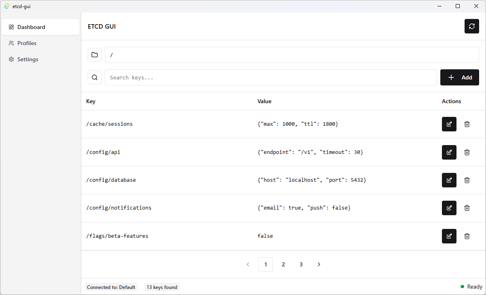

# ETCD GUI

A modern, cross-platform desktop application for managing etcd key-value databases. Built with Tauri, React, and Chakra UI.



## Features

- 🔑 Browse, search, create, edit, and delete etcd keys with a clean interface
- 🔒 Support for authentication and secure connections
- 🔄 Multiple connection profiles for different etcd clusters
- 🌓 Light and dark mode support
- 📱 Responsive UI that adapts to window sizes
- 🔌 Cross-platform (Windows, macOS, Linux)

## Installation

### Pre-built Binaries

Download the latest release from the [Releases](https://github.com/yourusername/etcd-gui/releases) page.

### Building from Source

Prerequisites:
- [Rust](https://www.rust-lang.org/tools/install)
- [Node.js](https://nodejs.org/) (v16 or higher)
- [pnpm](https://pnpm.io/installation) (recommended) or npm

```bash
# Clone the repository
git clone https://github.com/yourusername/etcd-gui.git
cd etcd-gui

# Install dependencies
pnpm install

# Run in development mode
pnpm tauri dev

# Build for production
pnpm tauri build
```

## Usage

### First-time Setup

When you first launch ETCD GUI, you'll be greeted with an onboarding screen to set up your first connection profile:

1. Enter a name for your profile
2. Add one or more etcd endpoints (host and port)
3. Enter username and password if authentication is enabled
4. Adjust timeout settings if needed
5. Click "Create Profile" to connect

### Managing Keys

- **Browse Keys**: Navigate through your etcd database using the key prefix filter
- **Search**: Quickly find keys or values containing specific text
- **Add Keys**: Click the "Add" button to create new key-value pairs
- **Edit Keys**: Click the edit button on any key to modify its value
- **Delete Keys**: Remove keys with the delete button (confirmation required)

### Connection Profiles

Manage multiple etcd connections through the Profiles tab:

- Create new profiles for different environments (dev, staging, production)
- Edit existing profiles to update endpoints or credentials
- Switch between profiles with a single click
- Test connections before saving

### Settings

Customize your experience in the Settings tab:

- Choose between light, dark, or system theme
- Configure application behavior
- Set default connection options

## Configuration

Configuration is stored in:
- Windows: `%APPDATA%\etcd-gui\config.json`
- macOS: `~/Library/Application Support/etcd-gui/config.json`
- Linux: `~/.config/etcd-gui/config.json`

## Development

### Project Structure

- `src-tauri/`: Rust backend code
  - `src/client.rs`: ETCD client implementation
  - `src/config.rs`: Configuration management
  - `src/core.rs`: Core business logic
  - `src/lib.rs`: Tauri command implementations
  - `src/state.rs`: Application state management
- `src/`: React frontend code
  - `components/`: UI components
  - `api/`: TypeScript interfaces for Tauri commands
  - `hooks/`: Custom React hooks

### Contributing

Contributions are welcome! Please feel free to submit a Pull Request.

## License

This project is licensed under the MIT License - see the [LICENSE](LICENSE) file for details.
